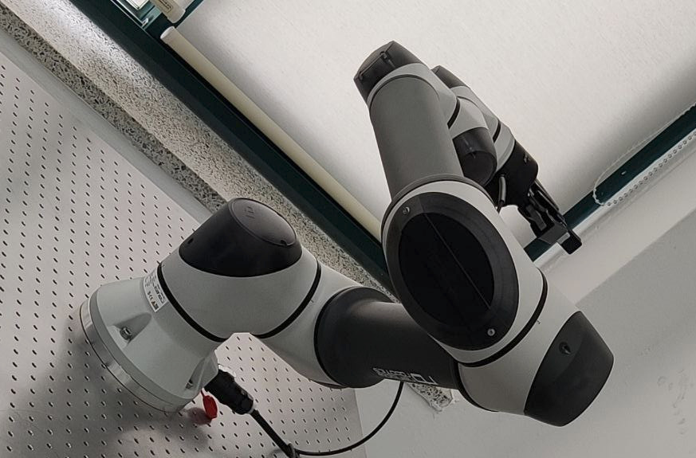

# Rainbow Robotics Arm ROS2

This package is an implementation of ROS2 based on python package from [rb-api](https://github.com/messy-snail/rb-api/). Only some function got implemented. I wrote this just for convenient of my lab use and also to study ROS2 myself. [for mom!]

## References [List](./doc/)
Some of the code is taken from some of other repo (all right belong to their respective author).
